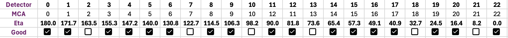

## CHAP_edd: Energy Dispersive Diffraction (EDD) commandline workflow at CHESS

 **CHAP_edd** is the analysis workflow for the ID1A3 station, designed to work with the **mapscan** data collection routines. With **mapscan**, the data reduction intention was prescribed through a *scantype* that was preserved through the data collection process. This document is a *brief* introduction to the basics of the CHAP workflow to perform a detector calibration, peak fit, and strain analysis. 

 ### 23-element energy dispersive diffraction detector

The 23-element edd detector and relevant reference frames are shown in the schematic below: 
 
 Figure 1: 23-element detector setup. *Note: the direction of eta and the increment of detector ID have opposite directions along the arc.* 

The ID1A3 EDD detector has 23 elements in an arc. Although the detector and slits are designed to be high precision, each detector can be calibrated independently to determine a refined 2theta angle.

Note: As of cycle 2024-3, only 17/23 detectors are commissioned for strain analysis. This chart indicates which detectors are currently operational: 

## CHAP Workflow Basics

The ChessAnalysisPipeline (CHAP) is a framework of modular building blocks that can be used to construct data processing workflows for different kinds of X-ray experiments. All CHAP workflows have the same building blocks: readers, processors, and writers to build up sophisticated data analysis pipelines. 

In the EDD workflow, these pipelines are built in yaml files (a type of structured text). CHAP can run these pipelines from the terminal, AKA commandline interface (CLI). 

To run CHAP on any CHESS networked system, you can use the prebuilt environment by following these steps: 

        source /nfs/chess/sw/minconda3_msn-c/bin/activate
        conda activate CHAP_edd

Now your terminal should show "(CHAP_edd)" before your username@computer prompt. 

It is common practice to navigate to the directory you wish to work from, save the yaml file in this location, and run the CHAP workflow from this location. 

Running a CHAP pipeline is simple: 

    CHAP <custom_edd_pipeline.yaml>

or 

    CHAP <custom_edd_pipeline.yaml> -p <specific_sub-pipeline>

Details of how this is performed for different pipelines and how to edit your .yaml will become clear in the detailed documentation for specific pipelines (such as calbration, strain analysis, etc.)

## Detector Calibration

Each detector needs to have two calibrations performed:
 - **Energy calibration**: this procedure scales/maps X-ray energies to the individual channels of each detector using the fluorecence peaks of a material standard. Fluoresence peaks have a *known energy* from which we can reliably tune this energy/channel mapping. 

 - **TwoTheta calibration**: this procedure determines the exact two-theta angle (AKA take-off angle) of the detector and downstream slit assembly with respect to the sample by fitting the *diffraction peaks* of a material standard (typically CeO2). 

 To run the detector calibration. 

