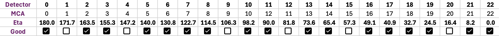

## CHAP_edd: Energy Dispersive Diffraction (EDD) commandline workflow at CHESS

 **CHAP_edd** is the analysis workflow for the ID1A3 station, designed to work with the **mapscan** data collection routines. With **mapscan**, the data reduction intention was prescribed through a *scantype* that was preserved through the data collection process. This document is a *brief* introduction to the basics of the CHAP workflow to perform a detector calibration, peak fit, and strain analysis. 

 ### 23-element energy dispersive diffraction detector

The 23-element edd detector and relevant reference frames are shown in the schematic below: 
 
 Figure 1: 23-element detector setup. *Note: the direction of eta and the increment of detector ID have opposite directions along the arc.* 

The ID1A3 EDD detector has 23 elements in an arc. Although the detector and slits are designed to be high precision, each detector can be calibrated independently to determine a refined 2theta angle.

Note: As of cycle 2024-3, only 17/23 detectors are commissioned for strain analysis. This chart indicates which detectors are currently operational: 

## CHAP Workflow Basics

The ChessAnalysisPipeline (CHAP) is a framework of modular building blocks that can be used to construct data processing workflows for different kinds of X-ray experiments. All CHAP workflows have the same building blocks: readers, processors, and writers to build up sophisticated data analysis pipelines. 

In the EDD workflow, these pipelines are built in yaml files (a type of structured text). CHAP can run these pipelines from the terminal, AKA commandline interface (CLI). 

To run CHAP on any CHESS networked system, you can use the prebuilt environment by following these steps: 

        source /nfs/chess/sw/minconda3_msn-c/bin/activate
        conda activate CHAP_edd

Now your terminal should show "(CHAP_edd)" before your username@computer prompt. 

It is common practice to navigate to the directory you wish to work from, save the yaml file in this location, and run the CHAP workflow from this location. 

Running a CHAP pipeline is simple: 

    CHAP <custom_edd_pipeline.yaml>

or 

    CHAP <custom_edd_pipeline.yaml> -p <specific_sub-pipeline>

Details of how this is performed for different pipelines and how to edit your .yaml will become clear in the detailed documentation for specific pipelines (such as calbration, strain analysis, etc.)

## Detector Calibration

Each detector needs to have two calibrations performed:
 - **Energy calibration**: this procedure scales/maps X-ray energies to the individual channels of each detector using the fluorecence peaks of a material standard. Fluoresence peaks have a *known energy* from which we can reliably tune this energy/channel mapping. 

 - **TwoTheta calibration**: this procedure determines the exact two-theta angle (AKA take-off angle) of the detector and downstream slit assembly with respect to the sample by fitting the *diffraction peaks* of a material standard (typically CeO2). 

 To run the detector calibration, first create/edit a yaml with the pipeline items for energy and/or tth calibrations: 

    #detector_calibration.yaml

    #Basic configuration
      config:
      root: .
      outputdir: out 
      interactive: true 
      log_level: debug
      profile: false

    #Energy Calibration Pipeline 
    energy: 

      # Read the detector data
      - common.SpecReader:
          config:
            station: id1a3
            experiment_type: EDD
            spec_scans:
              - spec_file: /nfs/chess/id1a3/2024-3/lastname-1234-a/ceo2-1016-50um-1/spec.log
                scan_numbers: 1

      # Perform energy calibration
      - edd.MCAEnergyCalibrationProcessor:
        background: auto
        config:
          peak_energies: [34.28, 34.72, 39.26] #fluorescence peaks of ceo2
          fit_index_ranges: [[650, 850]] #range of channels that peak energies should be found over
          max_peak_index: 1
          #list all detectors you want to have calibrated
            detectors: 
              - id: 12 #eta 90
              - id: 22 #eta 0
            baseline: true
            background: linear
            save_figures: true
            schema: edd.models.MCAEnergyCalibrationConfig

      # Save the calibration configuration at the only-energy-calibrated stage
        - common.YAMLWriter:
          filename: energy_calibration_result.yaml
          force_overwrite: true

    #Two-theta Calibration Pipeline
    tth:

      # Read the tth calibration spec configuration and the 
      # calibration configuration at the only-energy-calibrated stage
      - pipeline.MultiplePipelineItem:
        items:
          - common.SpecReader:
              config:
              station: id1a3
              experiment_type: EDD
              spec_scans:
                - spec_file: /nfs/chess/id1a3/2024-3/lastname-1234-a/ceo2-1016-50um-1/spec.log
                  scan_numbers: 1
          - common.YAMLReader:
              filename: out/energy_calibration_result.yaml
              schema: edd.models.MCATthCalibrationConfig

      # Perform the tth calibration
      - edd.MCATthCalibrationProcessor:
          calibration_method: direct_fit_residual
          tth_initial_guess: 5.6 #from setup 
          include_energy_ranges:
            - - 65.0
              - 140.0
          baseline: true
          background: linear
          fwhm_min: 3
          fwhm_max: 25
          save_figures: true

      # Save the energy-and-tth-calibrated calibration configuration
      - common.YAMLWriter:
          filename: tth_calibration_result.yaml
          force_overwrite: true

        
#### Running the Energy Calibration

Run the energy calibration by using pipeline flag (-p) and the name of the pipeline you want (energy) to run within your detector_detector.yaml:  

        CHAP detector_calibration.yaml -p energy

If **interactive: true** in the yaml, then the following interactive windows will pop-up for each detector: 

*Find baseline for background subtraction*

*The log(lambda) term can be used to change the baseline sensitivity to the shape/structure of the spectra.* 

**Confirm** when you are happy with the baseline fit. 

*Confirm Peak range for fluorecence peaks*

The range is populated from the yaml and typically is NOT changed. For this step we are ONLY looking to use the fluorecence peaks of the CeO2 - NOT the diffraction peaks. 1A3 has an energy range of 50-200 keV entering the hutch, so all X-ray energies below 50 are likely from fluorescence, not diffraction peaks. 

**Confirm** when you have the correct range (if you are using CeO2 as the only calibrant, your included range should look similar to this image). 

*Confirm peak positions are near the peaks in the data*

**Confirm** the red lines correspond to peaks in the data. 

Now the peaks will be fit and the energy will be scaled for the detector channels. The output of this optimization will pop up. This image will be saved in your output director if **save_figures: true** under the "**energy:**" pipeline. 

*A good calibration will show a well-fit peak and a reasonable linear fit*

The results are populated for the energy fields only in the **energy_calibration_result.yaml**. 

#### Running the Two-theta Calibration

Run the two-theta calibration by using pipeline flag (-p) and the name of the pipeline you want (tth) to run within your detector_detector.yaml:  

        CHAP detector_calibration.yaml -p tth

If **interactive: true** in the yaml, then the following interactive windows will pop-up for each detector: 

*Find baseline for background subtraction*

*The log(lambda) term can be used to change the baseline sensitivity to the shape/structure of the spectra.* 

**Confirm** when you are happy with the baseline fit. 

*Provide estimated tth value*

*The peak positions should align with the projected hkl planes (dotted lines). Modify the tth value in the window until they are roughly centered* 

**Confirm** when you are happy with the tth value. 

*Provide range overwhich to perform the tth fit*

*Include the range you plan on using during data reduction of your actual sample. The range should not be lower than 50keV since the incident beam does not have energies lower than 50 keV. The peaks you see at the lower energies are likely fluorescence peaks*

After the peak fitting process, the optimized tth and fit values will be populated in the **tth_calilbration_result.yml**. This is the same yaml structure as the energy_calibration_result.yml, but now the tth fit parameters are updated. 

The fits will pop up at the end of this pipeline.  This image will be saved in your output director if **save_figures: true** under the "**tth:**" pipeline. 

