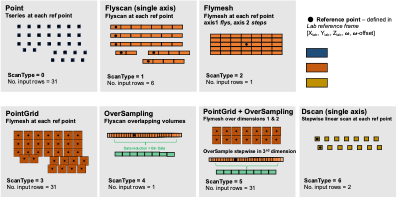
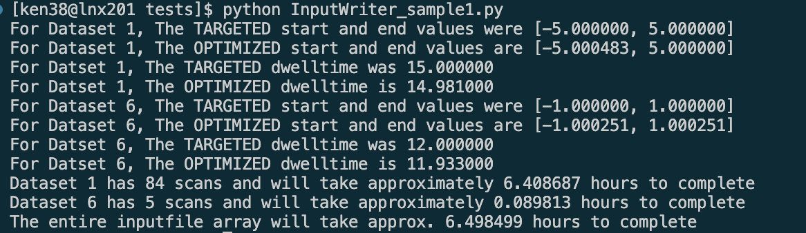

## Input Writer for Energy Dispersive Diffraction (EDD) Workflow

### Overview

To collect synchrotron data at specific points and orientations within a sample, an input file needs to be generated that prescribes a series of scans a for the controller (SPEC) to execute. 

This input file consists of many columns of data that can be described in 4 categories:
1. **Dataset descriptors** (e.g. dataset ID, configuration description)
2. **Reference points** in the sample (provided in either the sample or the lab (X-ray) reference frame). 
3. **Data collection parameters** for the X-ray instrument and detector configurations
4. **Scan-Strategy Parameters** for different scan types (e.g. point-dwell, flyscanning, etc.)

To generate an input textfile, the following two items must be populated/provided by the user:

-  *Reference Point Array*
- *EDD Input Configuration Dictionary* 

These items will be incorporated into an `InputWriter_template.py` templated script - designed to be edited by the user. 

The `InputWriterUtil.py` provides a series of functions that generates data collection routines that most closely match the desired scan outcomes. The specific intricacies (and quirks) in the data collection software and hardware are taken into account during the optimization of the input parameters. For this reason, *we do not recommend generating input arrays in an alternative way.*

The textfile generated during this process is not intended to be human/user readable. 

***

### Getting Started

Copy the `InputWriter_template.py` and `InputWriterUtil.py` into the same working directory. 

The preferred working directory on the CHESS filesystem during data collection is:

        /nfs/chess/aux/cycles/<beamtime_cycle>/id1a3/<your_btr>/holding_bay

### Editing the InputWriter_template.py

The InputWriter_template.py has the following structure: 

        # --------- import dependecies ----------
        import numpy as np
        import InputWriterUtil as iwrite

        # ---------- name input textfile -----------
        base_dir = ''
        filename = 'OutputForSpec_date_sample.txt'
        f = base_dir+filename_suffix

        # ---------- generate reference point list (one per dataset) ----------
        
        ##########################################
        ##### This section is user-defined #######
        ##### See reference examples #############
        ##########################################
 
        # lab_ref_points_<datasetno> is an array of points in the lab reference frame generated in this section:

        lab_ref_points_1 = XYZWs
        lab_ref_points_2 = XYZWs_2

        # ---------- EDD input configuration dictionary (one per dataset) -----------

        config_dataset_1 = {
            'dataset_ID': 1,
            'configuration_no': 1,

            'horz_slit': 0.05,
            'vert_slit': 0.05,
            'detector_slits': 0.05,

            'scantype': 1,

            'axis1': 'z',
            'start1': -5,
            'end1': 5,
            'numframes1': 18,

            'offbias': 'fix_end',

            'dwelltime': 15
        }

        config_dataset_2 = {
            'dataset_ID': 4,
            'configuration_no': 2,

            'horz_slit': 0.08,
            'vert_slit': 0.08,
            'detector_slits': 0.08,

            'scantype': 3,

            'axis1': 'z',
            'start1': -0.5,
            'end1': 0.5,
            'numframes1': 5,

            'axis1': 'z',
            'start1': -0.5,
            'end1': 0.5,
            'numframes1': 5,

            'offbias': 'fix_end',

            'dwelltime': 3
        }

        # ---------- write text array  -----------

        datasets_for_inputfile = [config_dataset_1, config_dataset_2] #write in priority order
        lab_ref_points = [lab_ref_points_1, lab_ref_points_2] #match with above priority order

        iwrite.combine_and_write_datasets(datasets_for_inputfile, lab_ref_points, f)

### Designing a dataset

The data collection routine works by executing a series of **scans**:
- a **scan** is a prescribed data collection strategy and is smallest unit building block of a data collection routine
- various supported **ScanType**s can be utilized; there are currently 7 supported ScanTypes in the EDD data collection routine, discussed in detail in the *ScanType* documentation. 

Defining a **dataset**: 
- a **dataset** is a collection of **scans** the user intends to treat as one entity (e.g. strain map). There are often multiple datasets for a given sample.
- each **dataset** should be assigned a *unique integer number* by the user; there should not be repeated dataset numbers within a sample directory
- The ScanType must be the same for all scans within a dataset; if more than one ScanType is desired for a sample, it should be handled under a unique dataset ID

### ScanTypes ###

The seven current scantypes are illustrated in the figure below: 

<small>

| ScanType                | ScanType Int | SPEC Building Block | At each reference point | Data Integration Default | 
| -----------             | ------------ | -----------         |-----------    | -----------|
|Point                    | 0            | tseries             | Stop, take data | None |
|Flyscan                  | 1            | flydscan*           | Flyscan relative to reference point, framing at intervals between two positions | None |
|Flymesh                  | 2            | flydmesh*           | Flyscan relative to reference point, framing at intervals between two positions along fly axis, stepping in the second axis | None |
|PointGrid                | 3            | flydmesh*           | Stop, take small flymesh relative to reference point | integrate flymesh spectra at each point |
|Oversampling             | 4            | flydscan*           | Flyscan relative to reference point, framing at SMALL, OVERLAPPING intervals between two positions | integrate spectra along flyaxis over some binning range |
|PointGrid + Overesampling| 5            | flydmesh*           | Stop, take small flymesh relative to reference point, step in third axis in SMALL, OVERLAPPING intervals | integrate along oversampled "bin_axis"
|Dscan                    | 6            | dscan               | Dscan relative to a reference point, stopping stepwise at intervals and taking data | None

</small>

### Creating Reference Point Array ###

A **Reference Point Array** houses all the reference points for every **scan** that will be executed in the dataset. All scans move RELATIVE to this starting point. 

The reference point Array is *currently* defined in the *laboratory reference frame* (X-ray reference frame). 

The resulting reference array should be formatted as a vertical stack, where the *number of rows* is the *number of total scans*: 
        
    reference_point_array = np.array([[ Xlab, Ylab, Zlab, W, W-offset ]
                                      [ Xlab, Ylab, Zlab, W, W-offset ]    
                                      [ Xlab, Ylab, Zlab, W, W-offset ]
                                      [ Xlab, Ylab, Zlab, W, W-offset ]
                                      [ Xlab, Ylab, Zlab, W, W-offset ] 
                                      ...............
                                      [ Xlab, Ylab, Zlab, W, W-offset ]])

Where each row has a unique [ X lab, Ylab, Zlab, W, Wcorr ] position. W, AKA "omega", is the rotation about lab Z and provides a value that "squares" the sample to the X-ray beam. The W-offset prescribes a relative omega position from the "squared" omega. 

### EDD Input Configuration Dictionary

The EDD configuration is currently a dictionary defined within the `InputWriter_template.py` file. This dictionary holds the user-defined dataset, scan, and intrument configuration variables. These variables should be input as what the user is TARGETING for data collection. The input array writer will take these values and produce an optimized set of variables that will be used during data collection. Any discrepancies in the TARGET data collection values and ACTUAL data collection variables are typically exetremely small. Note: *Data analysis*  uses only the ACTUAL recorded data collection parameters and instrument state, not the TARGET values. 

An example annotated configuration dictionary is below for dataset '4' made up of scantype '3': 

        config_dataset = {
            # -------dataset descriptors -------
            'dataset_ID': 4, #user-defined integer identifier for dataset
            'configuration_no': 2, #sample configuration unique identifier for sample<>lab coordinate transformation

            # -------instrument descriptors -------
            'horz_slit': 0.08, #size of horizontal beam defining slit
            'vert_slit': 0.08, #size of vertical beam defining slit
            'detector_slits': 0.08, #size of detector slit gap

            # -------dwelltime -------
            'dwelltime': 3

            # -------scantype for dataset -------
            'scantype': 3,

            ### ABOVE > ALL KEYS REQUIRED ###
            ### BELOW > SCAN SPECIFIC REQUIREMENTS ###

            # -------scantype specific variables -------
            #these will be described on a per-scantype basis

            'axis1': 'z', #scantype specific 
            'start1': -0.5,  #scantype specific 
            'end1': 0.5,  #scantype specific 
            'numframes1': 5,  #scantype specific 

            'axis2': 'z',  #scantype specific 
            'start2': -0.5,  #scantype specific 
            'end2': 0.5,  #scantype specific 
            'numframes2': 5,  #scantype specific 

            # -------optimizer fixed position -------
            'offbias': 'fix_end', #scantype specific - hold 'center', 'fix_start', or 'fix_end'

            
        }

*SCAN SPECIFIC REQUIREMENTS*: *keys* are unique for the different scantypes as described below (*cf* ScanTypes Documentation): 

ScanType = 0 : 

     <no additional dictionary keys>

ScanTypes 1 & 4 : 

    'axis1'      # string of motor from the following options:  ['w','x','y','z']
    'start1'     # RELATIVE start position of scans from reference point in LAB ref frame - float
    'end1'       # RELATIVE end position of scans from reference point in LAB ref frame - float
    'numframes1' # number of frames taken over the range between start and end points
    'offbias'    # how offset from optimizer is applied for flyscan : ['center', fix_start', 'fix_end']

ScanTypes 2 & 3 : axis 1 is the flyscan motor, axis 2 moves in a stepwise fashion
            

    'axis1'      # string of motor from the following options:  ['w','x','y','z']
    'start1'     # RELATIVE start position of scans from reference point in LAB ref frame - float
    'end1'       # RELATIVE end position of scans from reference point in LAB ref frame - float
    'numframes1' # number of frames taken over the range between start and end points

    'offbias'    # how offset from optimizer is applied for flyscan: ['center', fix_start', 'fix_end']

    'axis2'      # string of motor from the following options:  ['w','x','y','z']
    'start2'     # RELATIVE start position of scans from reference point in LAB ref frame - float
    'end2'       # RELATIVE end position of scans from reference point in LAB ref frame - float
    'numframes2' # number of frames taken over the range between start and end points

ScanType 5 : axis 1 is the flyscan motor, axis 2 moves in a stepwise fashion

    'axis1'      # string of motor from the following options:  ['w','x','y','z']
    'start1'     # RELATIVE start position of scans from reference point in LAB ref frame - float
    'end1'       # RELATIVE end position of scans from reference point in LAB ref frame - float
    'numframes1' # number of frames taken over the range between start and end points

    'offbias'    # how offset from optimizer is applied for flyscan: ['center', fix_start', 'fix_end']

    'axis2'      # string of motor from the following options:  ['w','x','y','z']
    'start2'     # RELATIVE start position of scans from reference point in LAB ref frame - float
    'end2'       # RELATIVE end position of scans from reference point in LAB ref frame - float
    'numframes2' # number of frames taken over the range between start and end points

    'flyaxis'    # axis for integration

ScanType 6 : #dscan does not have an optimization#

    'axis1'      # string of motor from the following options:  ['w','x','y','z']
    'start1'     # RELATIVE start position of scans from reference point in LAB ref frame - float
    'end1'       # RELATIVE end position of scans from reference point in LAB ref frame - float
    'numframes1' # number of frames taken over the range between start and end points

Note on using dictionary : This file can also be made into a standalone textfile that is read into the python script. 

### Optimizer Bias for Flyscans ###

Two fields end up being changed to optimized the scan strategy: 
1. The total distance a flyscan travels: 
       
          total distance = abs(`start` - `end`) 
    
    A new value will be calculated for the total distance that is optimized for the controls system. Depending on which values are meaningful to preserve from the "targeted" flyscan values, change in total distance "offset" from the optimization can be applied in one of three ways using the 'offbias' key: 

        'offbias' : 'center'

    will keep the CENTER point fixed from the targeted flyscan parameters, distributing the offset equally over the start and end position 

        'offbias' : 'fix_start'

    will keep the START point fixed from the targeted flyscan parameters, applying the offset to the end position only

        'offbias' : 'fix_end'

    will keep the END point fixed from the targeted flyscan parameters, applying the offset to the start position only

2. The dwelltime: 

    Due to the way data is collected during a flyscan by our system, the dwelltime needs to be optimized in order to achieve the desired flyscan intervals / collection behavior. Note: this value can be as much as a few seconds different than the targeted dwelltime - so be conservative in the targeted dwelltime. There are no user-defined options for how this optimization is performed. 

### Print Statements ###

The `InputWriter_template.py` prints out a series of statements:
-  to convey how the optimization has modified the scan series
- how long the scans should take

See example here: 

### Resulting Input Array ###

For details on the input datafile, please see the current commissioning notes: 
[Commissioning Details For Input Arrays](https://docs.google.com/document/d/1IyG426aaRIGqH2YIqSCtYHjca22qHrm_iJxsmpZeNPk/edit)

