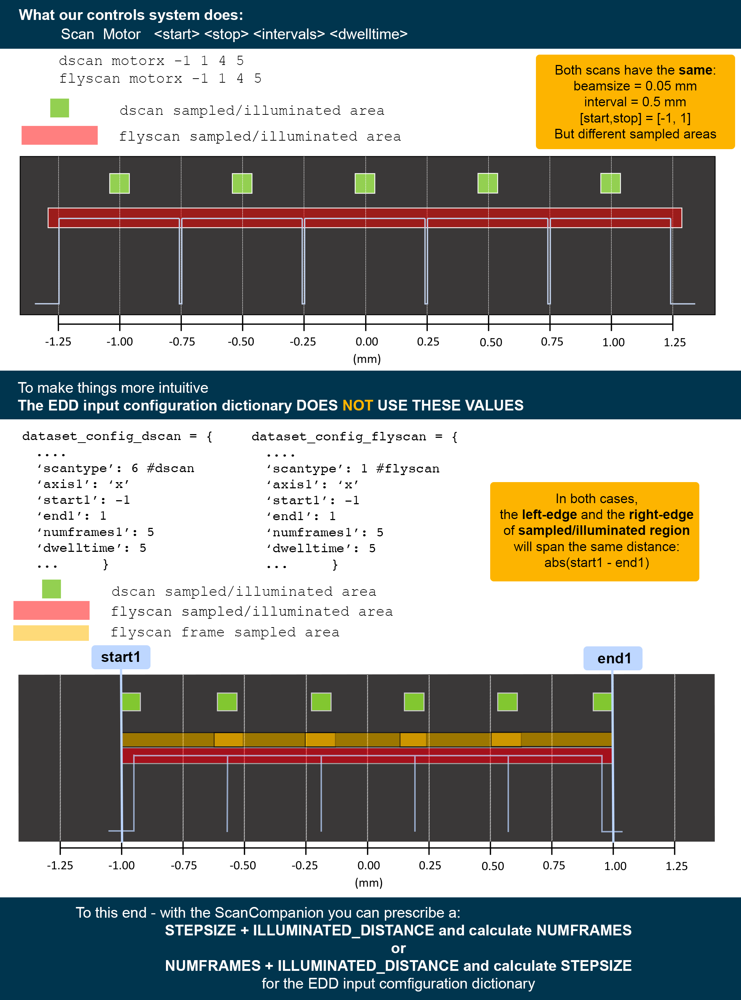

# ScanCompanion.py CLI Tool  #    
        
For **ScanTypes 1-6**: 
The `ScanCompanion.py` tool is a quick way to validate the scan parameters along individual dimensions to use in the *configuration input dictionary* (cf `InputWriterREADME.md`).  

There are many ways to think about each aspect of a SCAN: 
- Scan **number of frames**
- Scan **sampled/illuminated range**
- Scan **start** and **stop** positions 
- Scan **stepsize**

The *configuration input dictionary* (cf `InputWriterREADME.md`)
wants this described as the **start**,  **stop**, and **number of frames** (intervals) you wish to capture in the dataset.

Typically researchers prefer to prescribe their scans based on:
- **sampled/illuminated range** 
- And either **scanstepsize** or **number of frames**

The scan-strategy and x-ray beam size in the dimension you are scanning impact the total span that the X-rays illuminate: 

## Optimized Dwell Times and Parameters from Controller Quirks ##

need to write this section

## Running the Scan Companion ##

will update this but for now, here is a printout of the help menu: 

    usage: ScanCompanion.py [-h] (--stepsize STEPSIZE | --numpts NUMPTS) --distance DISTANCE [--dwelltime DWELLTIME] --beamsize
                        BEAMSIZE (-flyscan | -dscan)

    Calculate updated parameters based on DESIRED parameters for rsampX, rsampY, rsampZ flyscans.

    optional arguments:
    -h, --help            show this help message and exit
    --stepsize STEPSIZE   Desired step size in mm.
    --numpts NUMPTS       Desired number of points.
    --distance DISTANCE   Desired distance to be illuminated in mm.
    --dwelltime DWELLTIME
                            Dwell time in seconds.
    --beamsize BEAMSIZE   size of beamsize in mm in dimension you are scanning.
    -flyscan, --flyscan   indicates flyscan type
    -dscan, --dscan       indicates dscan type

    Additional information: You must provide a target DISTANCE and EITHER a STEPSIZE or NUMBER OF POINTS. If you provide a
    DWELLTIME, it will also be optimized.

Example of Output from running Scan Companion
----------
    [ken38@lnx201 ]$ python ScanCompanion.py --stepsize 0.05 --distance 1 --beamsize 0.08 --dwelltime 10 -flyscan
    Illuminated distance: 0.9806835136309027
    New step size: 0.05003797297949459
    Number of frames 18.0
    Updated dwell time 10.336

    [ken38@lnx201 ]$ python ScanCompanion.py --stepsize 0.05 --distance 1 --beamsize 0.08 --dwelltime 10 -dscan
    Illuminated distance: 1.03
    Stepsize 0.05
    Number of Frames 19.0
    Updated dwell time 10.0

-----------